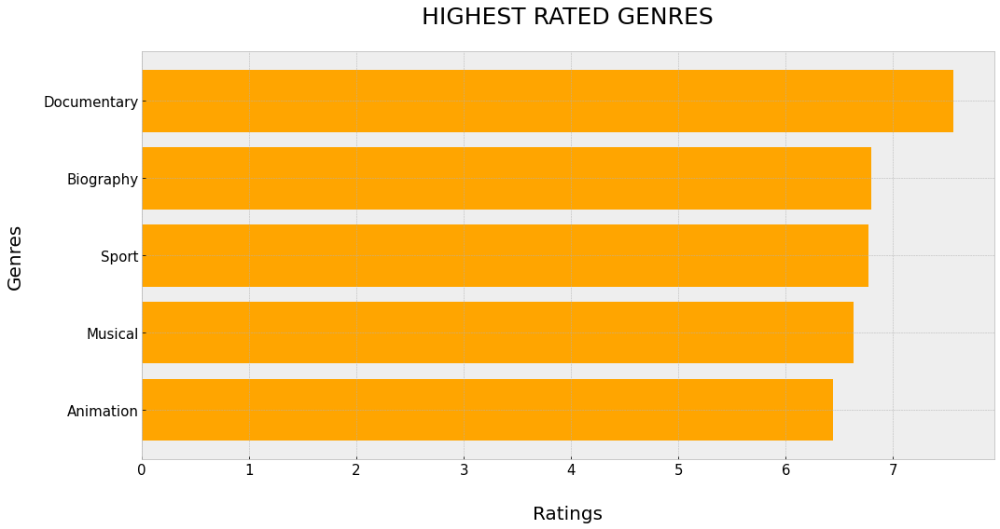

# MOVIE INDUSTRY ANALYSIS FOR MICROSOFT LTD

## Overview

Keeping in line with Microsoft's Motto of "Be What's Next!",Microsoft is looking to further diversfy its portfolio by venturing into the the Movie industry by creating a new business segment centered around the movie industry to be know as Microsoft Dream Factory (MDF). They would like to know the success factors that can be gleaned by carrying out a data analysis on various factors of the movie industry and turn those findings into actionable insight that can be used by the new head of Microsoft Dream Factory as they speared head this segment

## Business Understanding

The key to this explorative analysis will be to understand the success factors in the movie industry. According to S.Sowndarya, 2021 from the Journal of emerging technologies and innovative research states that the factors such as producer, production house, director, cast, runtime of the movie, genre, script, and time of release play a vital role in determining the success of a film. It can be noted that success of a film relates to the profit margins that the film house makes as well as the popularity of that film amongst the movie goers.

This shall form the basis of out research as we seek to answer the follwoing questions:
1. What genre has the highest rating in the past 5 years?
2. Which directors and writers should Microsoft Dream Factory(MDF) partner with?
3. Do higher populariry ratings actually mean more profits?
4. Who should Microsoft Dream Factory(MDF) partner with?

## DATA UNDERSTANDING
The data to be used within this exploratory analysis comes from the following sources:
1. [Box Office Mojo](https://www.boxofficemojo.com/)
2. [IMDB](https://www.imdb.com/)
3. [Rotten Tomatoes](https://www.rottentomatoes.com/)
4. [TheMovieDB](https://www.themoviedb.org/)
5. [The Numbers](https://www.the-numbers.com/)

The approach taken shall involve the following steps:
1. Data Mining
2. Data Cleaning
3. Data Analysis 
4. Data Visualization and Insights
5. Recommendations 

## OBSERVATIONS 

### 1. TREND ANALYSIS ON MOVIE INDUSTRY PERFORMANCE SINCE 2010
The movie industry has shown a continuous growth since 2010 both in the domestic market and worldwide

### 2. HIGHEST RATED GENRES SINCE 2010
The data provided insight into the genres that have the highest ratings amongst movie goers

### 3. TOP 5 MOVIE DIRECTORS AND WRITERS
From the data collected we were able to determine the top 5 movie directors and writers related to movie success

### 4. CORRELATION BETWEEN RATINGS AND PROFITS
Does higher ratings mean higher gross profits of a movie? The data provided insight into this correlation to determine movie success

### 5. HIGHEST PROFIT GENERATING STUDIOS
Benchmarking and potential partnerships were the key driving force with this data analysis as well as a comparison of the future competition

## RECOMMENDATIONS
From the thorough analysis the following is recommended:
1. The genres to most consider venturing into initially are documentary, biography,sport, musical and animation genres which have the highest rating.
2. Consider partnering with the highest rated directors and writers to produce the content that will net you the biggest profit margins
3. The top 5 studios should be considerd as a source of expertise as well as an avenue to explore international markets

## CONCLUSIONS
The information garnered gives us actionable insights to the success of the movie studion but it is missing some key factors that would determine the success of a studio such as marketing strategy, cultural impact analysis, Intellectual Property and Franchise Development and other factors that need to be further identified and analyzed.

